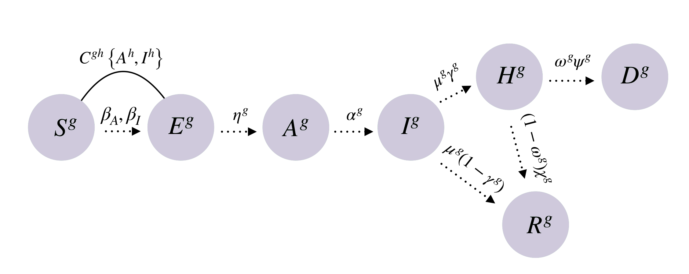

```{r setup, include=FALSE}
knitr::opts_chunk$set(echo = FALSE, warning = FALSE, message = FALSE, cache = TRUE, tidy = TRUE, tidy.opts = list(width.cutoff = 50))
library(tidyverse)
library(kableExtra)
library(networkD3)
options("kableExtra.html.bsTable" = T)
```


## Generalidades del modelo {.build}

* Modelo de Arenas *et al.* 2020
* Modelo SEAIHRM
* Estructurado por edad (0-25, 25-65, 65+)
* Realizado a nivel de Comuna (todas las comunas en forma simultanea)
* Permite manejo a nivel comunal (Cada comuna puede tener medidas de forma asincrónica)

## Flujo del modelo

```{r, out.width='80%', fig.asp=.75, fig.align='center'}

```


## Con conexiones espaciales

```{r, fig.align='center'}
require(igraph)
MatrixRegion <- readRDS("MatrixRegion.rds")
graph = graph_from_adjacency_matrix(MatrixRegion, "directed", weighted = T)
E(graph)$width <- E(graph)$weight*500
library(arcdiagram)
# create a star graph with 10 nodes
star_graph = graph.star(10, mode="out")
# extract edgelist
star_edges = get.edgelist(star_graph)
# plot 1: default arc diagram
vlabels = get.vertex.attribute(graph, "label")
op = par(mar = c(0.5, 5, 0.5, 3))
arcplot(igraph::as_edgelist(graph),lwd.arcs=E(graph)$width, labels = vlabels, cex.labels=0.8, horizontal=FALSE)
```


## Para comunas

```{r}
Red <- read_rds("/home/derek/Documents/Covid19_Chile_Age/Bases_de_datos/Datos_Chile/Probs_2020-04-13.rds")

Red <- Red %>% pivot_longer(cols = -destino, names_to = "origen", values_to = "Prob")

ggplot(Red, aes(x = destino, y = origen)) + geom_raster(aes(fill = log10(Prob))) + scale_fill_viridis_c() + scale_x_discrete(guide = guide_axis(check.overlap = TRUE)) + scale_y_discrete(guide = guide_axis(check.overlap = TRUE)) 
```

## Modelo

$$\rho_{i(t+1)}^{S,g} = \rho_{i(t)}^{S,g}(1 -  {\color{red}{K_{0(t)}} }\times CH_{i(t)})(1-\Pi_{i(t)}^g) $$

$$\rho_{i(t+1)}^{E,g} = \rho_{i(t)}^{E,g}(1 - {\color{red}{K_{0(t)}} }\times CH_{i(t)})\Pi_{i(t)}^g + (1- \eta^g)\rho_{i(t)}^{E,g}$$

$$\rho_i^{A,g}(t+1) = \eta^g\rho_i^{E,g}(t)+(1-\alpha^g)\times \rho_i^{A,g}(t)$$

$$\rho_i^{H,g}(t+1) = \mu^g\times \gamma^g \times \rho_i^{I,g}(t) + \omega^g(1 - \psi^g)\times \rho_i^{H,g}(t) + (1- \omega^g)(1-\chi^g)\rho_i^{H,g}(t)$$

$$\rho_i^{D,g}(t+1) = \omega^g \times \psi^g \times \rho_i^{H,g}(t) + \rho_i^{D,g}(t)$$
$$\rho_i^{R,g}(t+1) = \mu^g (1 -\gamma^g)\times \rho_i^{I,g}(t) + (1 - \omega^g) \chi^g \times \rho_i^{H,g}(t) + \rho_i^{R,g}(t)$$

* <font size="3">Cuando $K_{0i(t)}$ = 0 no hay cuarentena, si es 1 es cuarentena absoluta</font>
* <font size="3">$CH_{i(t)}$ es la probabilidad de que nadie en una casa este contagiado ($\sigma$ = 3.1)</font>


# Simulaciones recientes {.build}

## Manejo adaptativo vs Lockdown

* Desde el 30 de Marzo 
* Cuarentena adaptativa
* Cuarentena Nacional por 15 días

## Días en cuarentena

```{r}
setwd("~/Documents/COVID19/Informe_Ministerio")

library(tidyverse)

Results <- read_rds("Resultados_2020_04_10.rds") %>% dplyr::filter(Estrategia != "Sin Cuarentena") %>% ungroup() %>% mutate(Estrategia = ifelse(Estrategia == "Cuarentena General", "Cuarentena Nacional", "Cuarentena Adaptativa"))

Dias_Cuarentena <-Results %>% dplyr::filter(Estrategia == "Cuarentena Adaptativa")  %>% group_by(Comuna) %>% dplyr::filter(Cuarentena == "Cuarentena") %>% summarise(Dias_Cuarentena = n())


Eficiencia <- Results %>% dplyr::select(Comuna, Poblacion, Infectados, Estrategia, Fecha) %>% pivot_wider(names_from = Estrategia, values_from = Infectados) %>% mutate(Eficiencia = (`Cuarentena Nacional`/`Cuarentena Adaptativa`)) %>% group_by(Comuna) %>% dplyr::filter(Eficiencia == min(Eficiencia, na.rm = T)) %>% arrange(Eficiencia) %>% dplyr::mutate(Mitad = case_when(Eficiencia <= 0.5 ~ "Menos de la mitad", Eficiencia > 0.5  ~ "Mas de la mitad"))
Eficiencia$Rank <- 1:nrow(Eficiencia)

Grafico_Comuna <- Results %>% dplyr::filter(Comuna %in% c("arica", "rancagua", "puerto montt", "valdivia", "pudahuel", "punta arenas", "lo barnechea", "temuco", "ñuñoa")) 
```

```{r}
hist(Dias_Cuarentena$Dias_Cuarentena, main = "", xlab = "Días en cuarentena", ylab = "Frecuencia")
abline(v = 15, lty = 2, col = "red")
abline(v = median(Dias_Cuarentena$Dias_Cuarentena), lty = 2, col = "blue")
```


## UCI

```{r, out.width='90%', fig.align='center'}
ggplot(Grafico_Comuna, aes(x = Fecha, y = UCI)) + geom_line(aes(color = Estrategia)) + facet_wrap(~Comuna) + theme_bw() + ylab("Hospitalizados críticos")+ scale_y_continuous(labels = scales::comma) + theme(legend.position = "bottom")
```

## Fallecidos

```{r, out.width='70%', fig.align='center'}
ggplot(Grafico_Comuna, aes(x = Fecha, y = Fallecidos)) + geom_line(aes(color = Estrategia)) + facet_wrap(~Comuna) + theme_bw()+ scale_y_continuous(labels = scales::comma) + theme(legend.position = "bottom")
```

[Mas Comunas](https://www.ecoinformatica.net/COVID19.html)

## Nacional UCI

```{r, out.width='90%', fig.align='center'}
Grafico_Nacional <- Results %>% dplyr::group_by(Estrategia, Fecha) %>% summarise_if(is.numeric, sum)
ggplot(Grafico_Nacional, aes(x = Fecha, y = UCI)) + geom_line(aes(color = Estrategia)) + theme_bw() + ylab("Hospitalizados críticos")+ scale_y_continuous(labels = scales::comma) + theme(legend.position = "bottom")
```

## Nacional Fallecidos

```{r, out.width='90%', fig.align='center'}
ggplot(Grafico_Nacional, aes(x = Fecha, y = Fallecidos)) + geom_line(aes(color = Estrategia)) + theme_bw() + scale_y_continuous(labels = scales::comma) + theme(legend.position = "bottom")
```


## Nacional Acumulado

```{r}
ggplot(Grafico_Nacional, aes(x = Fecha, y = Infectados_Acumulados)) + geom_line(aes(color = Estrategia)) + theme_bw()  + scale_y_continuous(labels = scales::comma) + ylab("Infectados Acumulados") + theme(legend.position = "bottom")
```

## Tiempo de cuarentena nacional

* Empezando el modelo el 10 de abril

```{r}
Results <- read_rds("Results.rds") %>% dplyr::filter(Estrategia != "Dinámica") %>% mutate(Estrategia = str_replace(Estrategia, "Adaptativa 20 Abril", "Nacional 20 Abril"))
ResultadosNac <- Results %>% group_by(Fecha, Estrategia) %>% summarise_if(is.numeric, sum)


ggplot(ResultadosNac, aes(x = Fecha, y = UCI)) + geom_line(aes(color = Estrategia)) + theme_classic()

```


# Recomendaciones y conclusiones

## Recomendaciones

* Debiera instaurarse una cuarentena nacional
* Resultados preliminares dicen que cuanto mas temprano empieza la cuarentena nacional es mejor
* Esto beneficiará más a las comunas que no han tenido cuarentenas
* Antes del peak la probabilidad de que que haya no hayan infectados, expuestos o asintomáticos en una casa bajan en el tiempo $CH_{i(t)}$

## Necesidades

* Transparencia en los datos por comuna
* Entrega de datos de Recuperados, Fallecidos, etc por comuna
* En un mundo ideal, generación de API para acceder a datos

## Recursos

* Repositorio [github](https://github.com/derek-corcoran-barrios/Covid19_Chile_Age) con los modelos y bases de datos
* Visualizador [de datos](https://www.ecoinformatica.net/COVID19.html)